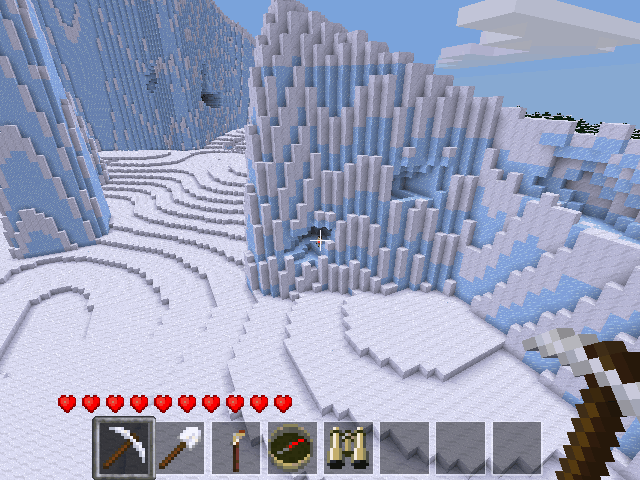
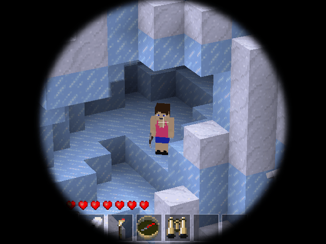

Bino Mask [bino_mask][proof of concept]
=====================

Places a black mask with a circular window in Zoom mode.



When this mod is enabled, pressing the 'Z' key (zoom) will give the following (if in creative mode, or have binoculars).

Note that this is a proof of concept only, with many limitations.

- Minetest source code needs to be patched to detect state of 'Z' key.
- Reads aspect ratio from minetest.conf at startup, so can't use multiple aspect ratios or change aspect ratio without restarting server.
- Some lag between zoom and mask changes.



However, for this mod to work, the minetest source needs to be patched with the provided patch file, which was generated using a recent 5.0 development version of minetest.  Note that both the server and client need to be patched.

```
patch file:  minetest_zoom.patch
commit 0d55879a1ad29322d586a1acc1bb6de1fa6b3f6d
Date:   Wed Jul 25 22:56:11 2018 -0400
```
This patch makes the following changes:
```
src/games.cpp:                       added KeyType::ZOOM to keypress_bits
src/network/serverpackethandler.cpp  added player->control.zoom
src/script/l_object.cpp:             added control.zoom to PlayerControl &control
```

To use this patchfile (from a linux system):
```
cd minetest
patch -p1 < /path/to/minetest_zoom.patch
compile as normal
```